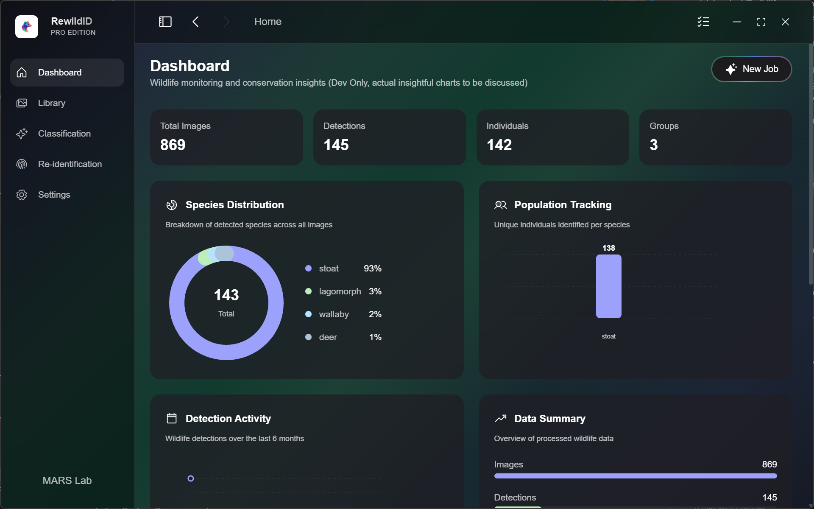
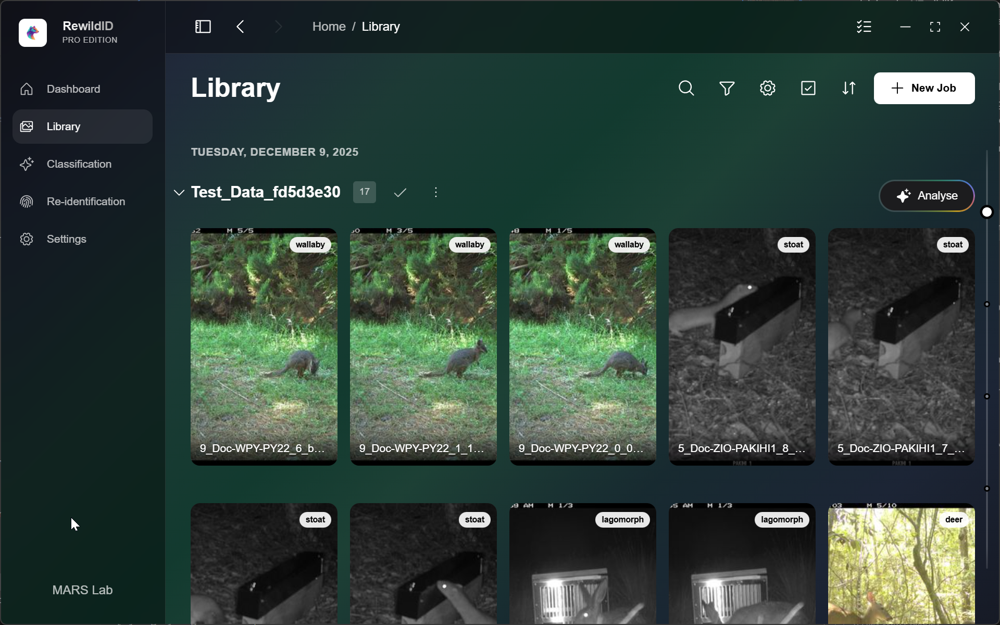
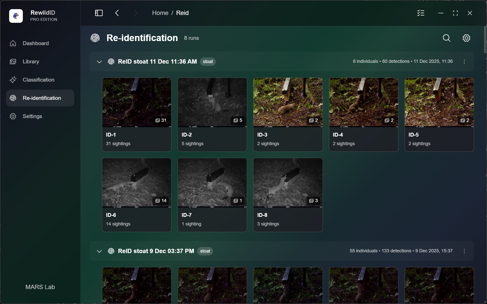
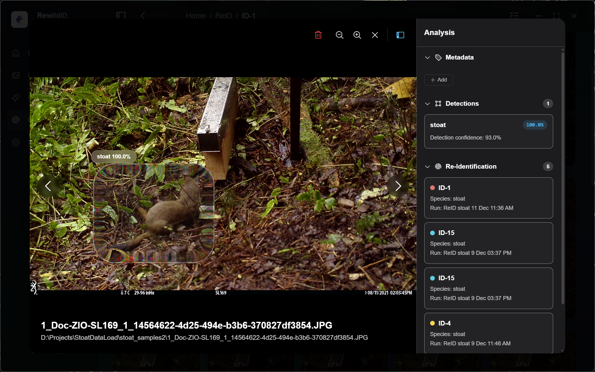

<div align="center">
  
  <h1>ReWildID Pro</h1>
  <p><strong>AI-Powered Wildlife Re-Identification Platform</strong></p>
  <p>Identify species and re-identify individual animals using advanced machine learning</p>

  <!-- Badges -->
  <p>
    
    
    
    
    
    
  </p>

  <p>
    
    
  </p>
</div>

---

<p align="center">
  
</p>

<p align="center">
  <a href="https://www.canva.com/design/DAG-yR29Dt0/Y8AGxCuysVKq6h8kqaXcwg/watch?utm_content=DAG-yR29Dt0&utm_campaign=designshare&utm_medium=link2&utm_source=uniquelinks&utlId=h0d8f076efa">
    
  </a>
</p>

---

## ✨ Features

<table>
  <tr>
    <td align="center" width="33%">
      <h3>🖱️ Ultra-Simple Workflow</h3>
      <p>Drag & drop your images, select Re-ID, click OK — that's it! The entire process is streamlined for maximum efficiency.</p>
    </td>
    <td align="center" width="33%">
      <h3>🔍 Species Detection</h3>
      <p>Automatically detect and classify wildlife in images using state-of-the-art YOLO and transformer models.</p>
    </td>
    <td align="center" width="33%">
      <h3>🎯 Individual Re-ID</h3>
      <p>Match individual animals across multiple sightings with advanced embedding-based recognition.</p>
    </td>
  </tr>
  <tr>
    <td align="center" width="33%">
      <h3>⚡ Lightning Fast</h3>
      <p>Smart embedding cache and fault recovery ensure blazing performance. Re-run upload & analysis in seconds, not minutes.</p>
    </td>
    <td align="center" width="33%">
      <h3>📚 Media Library</h3>
      <p>Organize and browse your wildlife imagery with powerful search, tagging, and filtering capabilities.</p>
    </td>
    <td align="center" width="33%">
      <h3>🤖 AI Assistant</h3>
      <p>Natural language interface for data queries — ask questions about your wildlife data in plain English, and draw visualisation in seconds. This feature is disabled and not accessible for Te Mana Raraunga compliance reasons, the code is provided in this repository for your reference.</p>
    </td>
  </tr>
  <tr>
    <td align="center" width="33%">
      <h3>🎨 Beautiful UI</h3>
      <p>Modern glassmorphism design with customizable themes. Dark mode, light mode, and everything in between.</p>
    </td>
    <td align="center" width="33%">
      <h3>📊 Dashboard</h3>
      <p>Visual analytics and monitoring with real-time insights into your wildlife tracking data.</p>
    </td>
    <td align="center" width="33%">
      <h3>🔄 Fault Recovery</h3>
      <p>Robust error handling ensures your work is never lost. Resume interrupted jobs seamlessly.</p>
    </td>
  </tr>
</table>

---

## 🌿 About the Project

New Zealand is home to some of the world's most unique fauna, but these native species face significant threats from invasive pests. [One such predator is the stoat, which preys on the young of native birds.](https://www.doc.govt.nz/nature/pests-and-threats/animal-pests-and-threats/stoats)

ReWildID Pro (formerly CARE) was developed to assist in monitoring and controlling the presence of stoats and other wildlife on Waiheke Island. The platform leverages machine learning and artificial intelligence to accurately identify species and re-identify individual animals captured in photos. By utilizing advanced image recognition algorithms, the platform can differentiate between various species, ensuring precise identification and effective monitoring. This innovative approach not only enhances the efficiency of conservation efforts but also contributes to the broader goal of preserving New Zealand's unique biodiversity.

---

## 📸 Screenshots

<p align="center">
  <strong>Dashboard</strong><br/>
  
</p>

<p align="center">
  <strong>Media Library</strong><br/>
  
</p>

<p align="center">
  <strong>Re-Identification Results</strong><br/>
  
</p>

<p align="center">
  <strong>Image Viewer (Optional Liquid Glass Bounding Box)</strong><br/>
  
</p>

## 🚀 Getting Started

### Prerequisites

- **Node.js** 18+ 
- **Python** 3.10+
- **Git**

### Installation

```bash
# Clone the repository
git clone https://github.com/your-org/rewildid-pro.git
cd rewildid-pro

# Install frontend dependencies
cd "ReWildID Pro"
npm install

# Install Python dependencies
cd ../python
pip install -r requirements.txt

# Run the application
cd "../ReWildID Pro"
npm run dev
```

### Quick Start

**Classic Workflow**
1. **Import Images** — Drag & drop your wildlife photos into the Library
2. **Run Detection** — Select images and click "Detect" to identify species
3. **Re-Identify** — Select detected animals and click "Re-ID" to find matches
4. **Review Results** — Browse matched individuals in the ReID results page

**Ultra-Simple Workflow**
1. **Import Images & Run Re-ID** — Drag & drop your wildlife photos into the Library and click "Re-ID" to find matches.
2. **Review Results** — Browse matched individuals in the ReID results page.

---

## 🏗️ Tech Stack

| Category | Technologies |
|----------|-------------|
| **Frontend** | Electron, React, TypeScript, Virtualization, Three.js (Ray Tracing), LangChain (AI Agent) |
| **Backend** | Python, SQLite |
| **AI/ML** | Computer Vision, Deep Learning |
| **Storage** | Optimized local database with embedding cache |

---

## 📖 User Guide

The ReWildID Pro application comes with a comprehensive in-app user guide. It will show up the first time you open the application.

---

## � Installer

An installer is available. Please contact [Professor Yun Sing Koh](mailto:y.koh@auckland.ac.nz) to get a copy of the installer.

---

## �🛠️ Development

To run the code in this repository, you need the model PT files. Please contact [Professor Yun Sing Koh](mailto:y.koh@auckland.ac.nz) if you want a copy of the model files. We're working on a version of the model PT files that we can commit to the open source repository.

The application has two parts:
- **Electron UI** — See the [ReWildID Pro README](ReWildID%20Pro/README.md)
- **Python AI Runner** — See the [Python README](python/README.md)

---

## 👥 Contributors

- [**Yun Sing Koh**](https://profiles.auckland.ac.nz/y-koh) — Professor at the School of Computer Science, University of Auckland
- [**Di Zhao**](https://www.linkedin.com/in/di-zhao-56869498/) — 4th-Year PhD Student
- [**Yihao Wu**](https://www.linkedin.com/in/yihao-wu-justin327) — 1st-Year PhD Student
- [**Matthew Alajas**](https://www.linkedin.com/in/matthew-alajas-79762a136/) — Master Student
- [**Yuzhuo Li**](https://www.linkedin.com/in/yuzhuo-li-a4a8b4245/) — Master Student
- [**Chris Pearce**](https://github.com/cpearce) — Software Engineer

---

## 🤝 Collaborators & Acknowledgements

We would like to extend our sincere gratitude to Professor [Gillian Dobbie](https://profiles.auckland.ac.nz/g-dobbie), Dr. [Daniel Wilson](https://profiles.auckland.ac.nz/daniel-wilson), [Te Korowai o Waiheke](https://tekorowaiowaiheke.org/), and Capstone Team 39 for their invaluable contributions to the development of CARE (Previous version of ReWildID Pro). Their dedication, collaboration, and technical expertise have been instrumental in driving our work forward. We are also deeply grateful to Te Korowai o Waiheke for their support and partnership, whose commitment to environmental stewardship and community well-being continues to inspire and enrich our efforts. This project would not have been possible without the combined efforts of these outstanding partners.

---

## 📄 License

ReWildID Pro is licensed under the **GNU Lesser General Public License v3.0**.

See [LICENSE](LICENSE) for more information.

---

<div align="center">
  <p>Made with ❤️ for Wildlife Conservation</p>
  <p>
    <a href="mailto:y.koh@auckland.ac.nz">Contact</a> •
    <a href="https://profiles.auckland.ac.nz/y-koh">Research Lab</a>
  </p>
</div>
